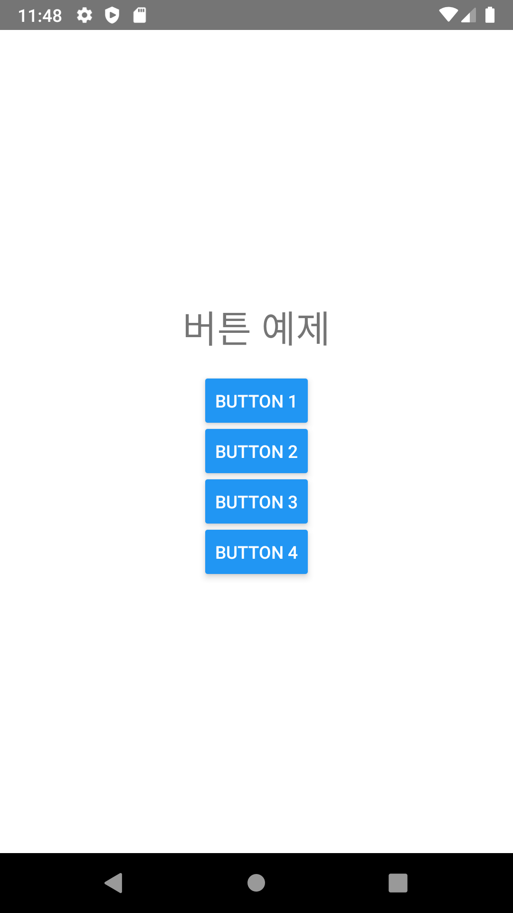
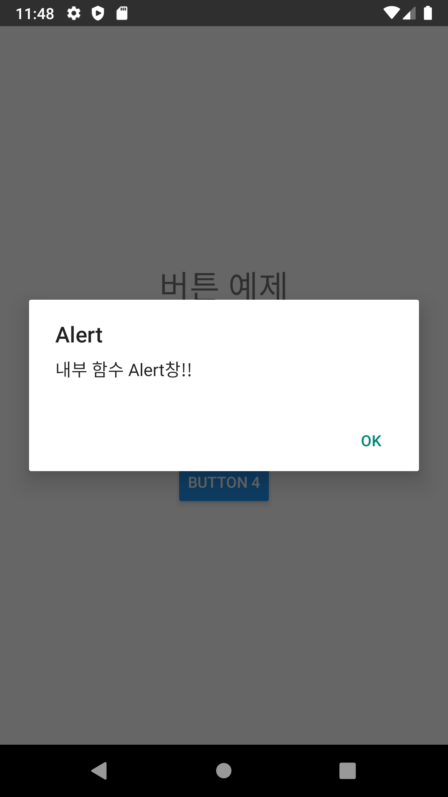

## ButtonSample1 설명

- React Native 용 버튼 예제
- 버튼 클릭시 4가지 형태의 alert를 뛰우는 예제

<br/>
<br/>

1. 버튼 onPress에 Alert() 함수를 바로 호출
```
<Button title="Button 1" onPress={() => alert('Click !!')} />
```
<br/>

2. App 함수 내부에 capAlert()를 선언하고 호출
```
<Button title="Button 2" onPress={this.capAlert} />
```
<br/>

3. App 함수 외부에 OuterAlert()를 선언하고 호출
```
<Button title="Button 3" onPress={() => OuterAlert()} />
```
<br/>

4. OuterFileAlert.js 파일을 생성하고 alert2()함수를 선언하고 호출
```
<Button title="Button 4" onPress={() => OuterFileAlert.alert2()} />
```

### 스크린샷





