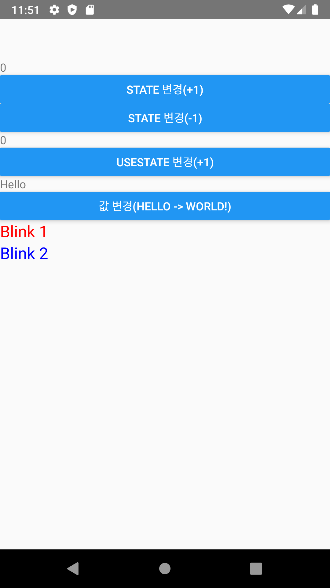

## ButtonSample2 설명

- React Native 용 버튼 예제

 
 

1. 버튼에 타이머 사용해서 시간값을 출력한다. onPress에 시간값을 Alert()에 표시 하는 예제
 

2. TextInput에 입력된 내용을 버튼 클릭후 Text에 표시 하는 예제, 이 부분에서 이슈는 setState()를 사용하기 위해서는 Component를 상속받아야 하는걸로 확인되었다.
 

### 스크린샷

